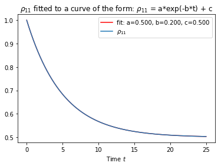

# Week 1
We have implemented an algorithm to solve the Lindblad equation for a spin 1/2 system, with relaxation and decoherence, using a sort-off Euler method. In the relaxation plot we start off in the up state and over time, due to relaxation and excitation processes, these slowly decay to 1/2. This is because the up->down process has same rate as the down->up process. In the decohernce plot we start of in the plus state (up + down) and this state decays to 0, in an oscillatory fashion, which is what we expect to happen! Next step is to upgrade to more complex state, such as the entangled state and the coherent state of light. We could also maybe implement Verlet method instead of Euler method to solve the equation. 

# Week 2
This week we fitted the curves of the relaxation plot and show that the up->down process has the same rate as the down->up process namely $`\gamma=0.200`$.

We also implemented a spin echo experiment. The spin echo experiment is as follows: $`R_{\hat{x}}(\pi/2) \rightarrow R_{\hat{x}}(\pi) \rightarrow R_{\hat{x}}(\pi/2)`$. Between the pulses we wait a time $`\tau`$, here the system evolves according to the Lindblad equation. In the Figure below we have varied $`\tau`$ and plotted the fidelity of the state without the spin echo ($`F_A`$) and with the spin echo ($`F_B`$). As expected, the fidelity of the state with echo is consistently better than without, which is the goal of the spin echo.

